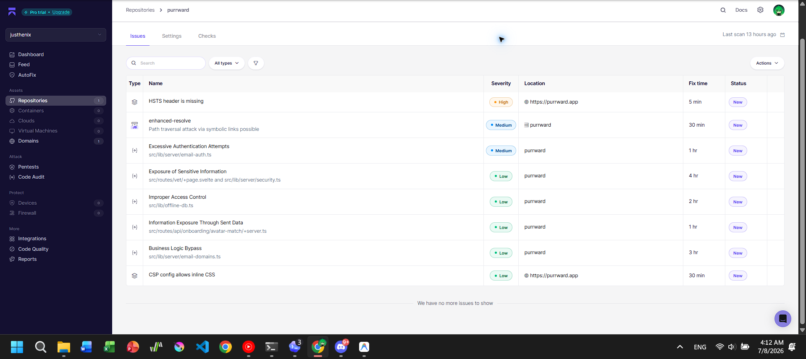
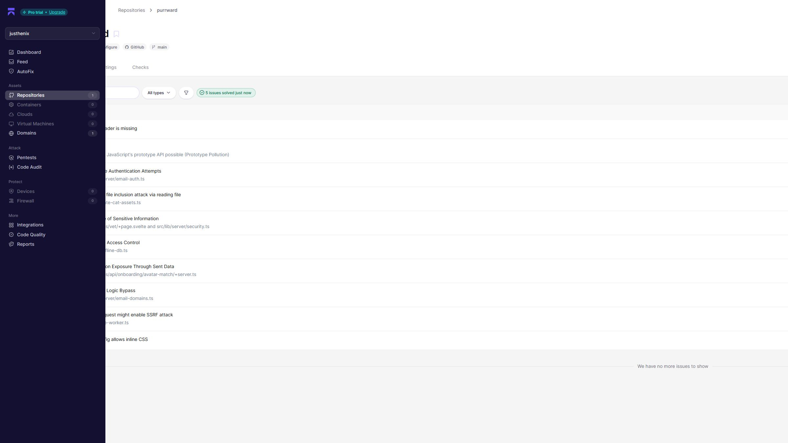
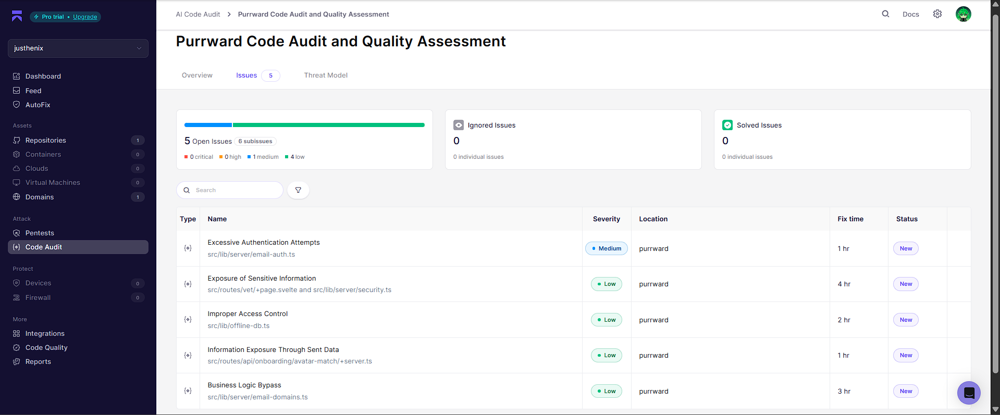

<!-- Submission note: Aikido scan evidence and unresolved external items. -->

# Aikido Test

Status: latest fixes pushed to `main` and deployed; Aikido dashboard still shows stale/open rows pending its next clean refresh.

Repository: https://github.com/justhenix/purrward
Branch scanned: `main`
Production URL: https://purrward.app
Checked: 2026-07-08 04:42 +07:00

## Evidence

- AI Code Audit: `f19f3e51-b6c4-8958-b096-3c95de7efd60`
- Repository issues screenshot: `documentation/aikido-repository-issues.png`
- Post-fix recheck screenshot: `documentation/aikido-recheck-after-fixes.png`
- AI Code Audit screenshot: `documentation/aikido-code-audit.png`
- Repository/domain issue list at 04:12 +07:00 showed 8 open issues before the latest fixes were pushed.
- Post-fix Aikido recheck still displayed stale/open rows, but local checks and production HEAD checks passed.
- Local dependency audit after fixes: `bun audit` found no vulnerabilities.

## Aikido Findings Seen

| Finding                                       | Action                                                                                                                      |
| --------------------------------------------- | --------------------------------------------------------------------------------------------------------------------------- |
| CSP header not set                            | Previously resolved by Aikido retest.                                                                                       |
| Missing anti-clickjacking header              | Previously resolved by Aikido retest.                                                                                       |
| HSTS header missing                           | HEAD response returned 500 before this fix; built output now returns HEAD 200 with security headers. Needs deployed retest. |
| CSP config allows inline CSS                  | Low severity; accepted for current Svelte dynamic style attributes to avoid breaking the demo UI.                           |
| Server leaks version info via `Server` header | Cloudflare-managed header; documented as platform residual if Aikido keeps it open.                                         |
| `enhanced-resolve` path traversal             | Fixed by package override to `enhanced-resolve@5.24.2`.                                                                     |
| `zod` prototype pollution                     | Updated to `zod@4.4.3`; app checks and build pass.                                                                          |
| Script file inclusion                         | Hardened cat asset generator to resolve and enforce paths inside `src/lib/assets/cats`.                                     |
| Service worker SSRF                           | Removed same-origin network proxy fallback for non-precached requests.                                                      |
| GitHub organization IP allow list             | GitHub org policy item; documented as account-level residual if Aikido keeps it open.                                       |

## AI Code Audit Findings

| Finding                                | Severity | Location                                                    | Action                                                                                           |
| -------------------------------------- | -------- | ----------------------------------------------------------- | ------------------------------------------------------------------------------------------------ |
| Excessive Authentication Attempts      | Medium   | `src/lib/server/email-auth.ts`                              | Tightened auth/reset attempt limits to 5/hour.                                                   |
| Exposure of Sensitive Information      | Low      | `src/routes/vet/+page.svelte`, `src/lib/server/security.ts` | Stopped rendering server error text in vet chat and strips control chars from public text.       |
| Improper Access Control                | Low      | `src/lib/offline-db.ts`                                     | Scoped offline proof queue reads to the current user/sandbox identity.                           |
| Information Exposure Through Sent Data | Low      | `src/routes/api/onboarding/avatar-match/+server.ts`         | Require session auth before accepting avatar photos for Gemini matching.                         |
| Business Logic Bypass                  | Low      | `src/lib/server/email-domains.ts`                           | Canonicalized disposable email domains before blocklist matching; rejects malformed dot domains. |

Production `curl -I` at 04:44 +07:00 returned HTTP 200 for `https://purrward.app` and `https://www.purrward.app` with HSTS, CSP, and `X-Frame-Options`.
