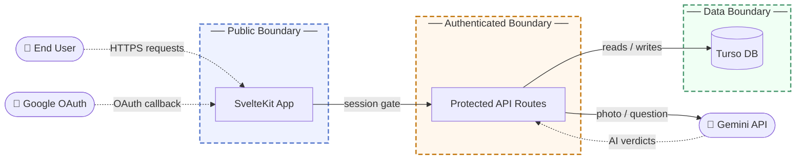

# Threat Model: Purrward Cat Wellness Application

## 1. Overview

Purrward is a cat wellness gamification web application. Users log daily care activities by submitting photos that a Google Gemini vision model verifies; verified tasks earn "Purrpoints" spendable on cosmetic items, gacha pulls, and partner reward coupons (vet discounts, treats, shelter donations). An AI vet triage chat provides basic feline health guidance using the same Gemini API.

Main components:

- SvelteKit web application deployed on Cloudflare Pages, serving both the UI and all API routes
- Dual-method authentication: Google OAuth 2.0 and email/password (PBKDF2)
- Care photo submission pipeline, AI-verified via Google Gemini vision API
- Purrpoints economy: gacha pull engine, direct item purchase, and reward redemption with partner businesses
- Cats and cosmetic inventory management
- AI vet triage chat (Gemini text generation)
- Turso (libSQL) cloud database holding all persistent state

This model covers the production web application and its outbound interactions with Google OAuth and the Gemini AI service.

## 2. Trust Boundaries

- **Public Boundary**: The SvelteKit server trusts that client IP addresses are accurate enough for rate-limiting purposes. Enforcement: per-IP request counters (100/min for API routes, 10/hour for auth endpoints) applied in the server hook before any request handler runs.

- **Authenticated Boundary**: Protected API routes trust that a presented session cookie corresponds to a real, unexpired session for the stated user. Enforcement: session cookie (HttpOnly, Secure, SameSite=Strict) validated against the sessions table on every request; user identity is always server-resolved and never derived from client-supplied data.

- **Data Boundary**: The Turso database trusts reads and writes to originate exclusively from the SvelteKit server process. Enforcement: the database auth token is held server-side as an environment secret; no database connection is reachable from the browser.

- The server partially trusts Gemini API to return analysis that reflects the actual content of submitted images and questions. Enforcement: user input is isolated inside server-owned prompt structures using XML scoping; all point awards and reward grants are computed server-side from validated model output and are bounded by independent per-user daily caps regardless of AI verdict.

## 3. Threat Scenarios

**AI Verification Gaming for Point Inflation**
An authenticated user submits adversarial, collaged, or reused images designed to fool the Gemini vision model into approving care tasks that were not genuinely completed, exploiting the system's reliance on the AI verdict as the primary gate for point awards. If the bypass is reliable, the attacker can accumulate Purrpoints across many accounts and systematically drain partner coupons and vet discounts at a rate that exceeds any legitimate care volume.

- Risk: Medium likelihood, Medium impact
- Mitigation: Supplement the AI verdict with server-side behavioral signals that flag accounts with implausibly high verification success rates or atypical task-distribution patterns, and use those signals to throttle or queue awards for review.
- Validation: Pentest: submit a set of adversarial and off-topic images against the verification endpoint and confirm per-user caps fire independently of model verdict; code review: verify no execution path awards points without recording a corresponding habit completion row.

**Prompt Injection via AI Vet Chat**
An authenticated user crafts a vet triage question intended to escape the server-owned prompt context and cause Gemini to produce content outside the defined cat-health scope, reveal system prompt contents, or generate advice that contradicts the intended guardrails. The server isolates user input inside XML tags and validates output structure, but language model instruction following is not cryptographically enforceable. A successful injection could surface harmful or off-topic content to the end user.

- Risk: Medium likelihood, Low impact
- Mitigation: Enforce strict server-side structural validation on every model response: reject any reply that fails to conform to the required intro-plus-three-bullet format before it reaches the client, treating structural deviation as an injection signal.
- Validation: Pentest: submit known prompt injection patterns (role reversal, instruction override, data extraction) via the vet question field and confirm the server rejects structurally malformed responses before they are returned.

**Session Token Persistence After Credential Compromise**
An attacker who obtains a valid session cookie retains full account access for the entire token validity window, including spending Purrpoints, equipping cosmetics, and redeeming coupons. Account access remains until the legitimate user explicitly logs out, resets their password, or authenticates again, none of which may occur promptly after discovery of the compromise. An attacker can exhaust all earned rewards before the victim takes corrective action.

- Risk: Low likelihood, High impact
- Mitigation: Expose a user-initiated "sign out all sessions" action that deletes all session rows for the authenticated user without requiring a credential change, so a user on a trusted device can revoke a suspected compromised session independently.
- Validation: Automated test: confirm all session rows for a user are deleted when the revoke-all action fires; pentest: verify the previously valid session cookie is rejected with a 401 on the next authenticated request after revocation.

**Cross-User Coupon Consumption via Authorization Bypass**
An authenticated user who learns or enumerates another user's reward redemption identifier attempts to mark that coupon as used against a partner of their choosing, consuming the victim's earned reward. Because redemption identifiers must be client-visible to initiate a trade, they can be observed in browser request logs, shared inadvertently, or exposed through future feature changes. A successful bypass removes the coupon with no recovery mechanism for the victim.

- Risk: Low likelihood, Medium impact
- Mitigation: Scope all coupon trade requests to identifiers that the calling user explicitly loaded through their own authenticated history endpoint; treat any redemption identifier not in the caller's session-scoped list as an authorization failure.
- Validation: Pentest: attempt to trade a redemption row owned by Account A while authenticated as Account B; confirm a 403 response is returned and no database mutation occurs.

**OAuth Account Takeover via Email Collision**
An attacker who pre-registers an email-and-password account using a target user's email address can trigger unintended account merging when the target next authenticates via Google OAuth, potentially granting access to the target's Purrpoints, cat profiles, and active reward codes. This exploits the account-linking logic that allows an incoming Google identity to be matched to an existing account based on a shared email, bridging two authentication paths without explicit user consent.

- Risk: Low likelihood, High impact
- Mitigation: Require an explicit in-session user confirmation step before linking an email-password account to an incoming Google identity; never auto-merge based solely on email match without presenting the user with the proposed linkage and a confirmation action.
- Validation: Pentest: register an email-password account with a designated test address, then authenticate via Google OAuth using the same email; verify that no automatic merge occurs and that neither account can access the other's data.

## 4. Architectural Fragilities

The Gemini vision API verdict is the single gate between a photo upload and a Purrpoints award. There is no secondary layer examining behavioral signals across accounts over time, no anomaly detection for implausibly high per-account success rates, and no human review queue for edge cases. The daily per-user caps bound per-account abuse but produce no signal for coordinated multi-account farming. Because every point award originates from one external AI call, introducing a behavioral backstop requires adding a separate data collection layer, an analysis service, and a feedback mechanism into the award flow. This is a design concern, not a configuration adjustment, and represents a gap in defense-in-depth for the core economy.
