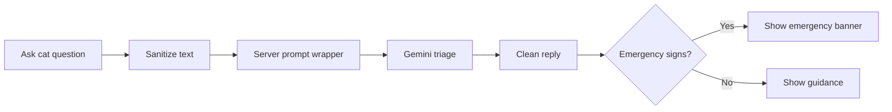

<!-- Developer doc: AI Vet triage flow. -->

# AI Vet flow

AI Vet gives triage guidance only. It does not diagnose, prescribe, or replace a licensed veterinarian.

Important files:

- `src/routes/vet/+page.svelte`
- `src/routes/api/vet/triage/+server.ts`
- `src/lib/server/vet-triage.ts`
- `src/lib/server/security.ts`
