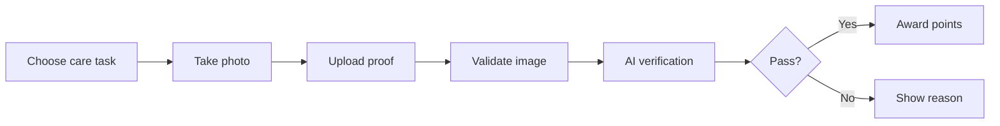

<!-- Developer doc: care proof verification flow. -->

# Care verification flow

Important files:

- `src/routes/care-proof/`
- `src/routes/api/verify/+server.ts`
- `src/lib/server/photo-verification.ts`
- `src/lib/server/security.ts`

The server validates task type and upload type before Gemini sees the image.
