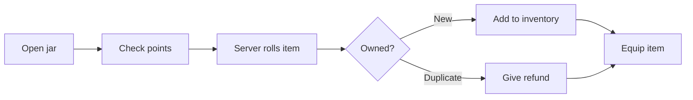

<!-- Developer doc: jar and gacha flow. -->

# Gacha flow

Gacha cost, odds, duplicate refund, and selected item are server-owned.

Important files:

- `src/routes/api/gacha/pull/+server.ts`
- `src/lib/server/gacha.ts`
- `src/lib/server/catalog.ts`
- `src/lib/server/inventory.ts`
