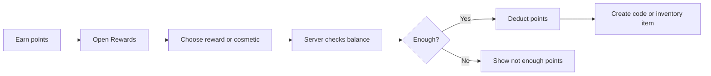

<!-- Developer doc: reward redemption flow. -->

# Reward flow

Reward codes are generated server-side. Direct cosmetic purchases write to account-wide inventory.

Important files:

- `src/lib/server/rewards.ts`
- `src/lib/server/purchase.ts`
- `src/lib/server/coupon-trade.ts`
- `src/lib/server/catalog.ts`
